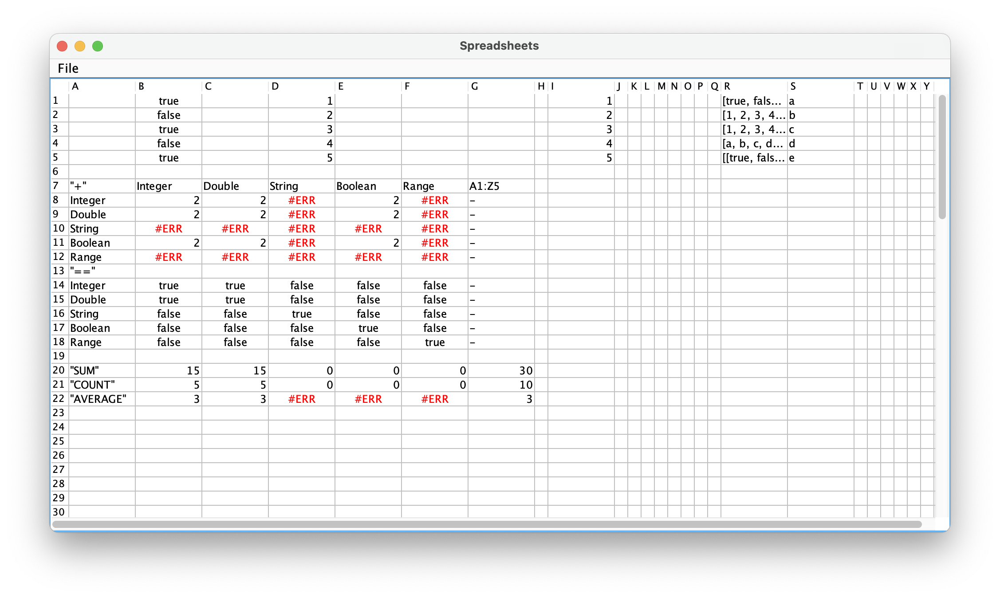

## Spreadsheet

---

### Features

- Formula and Expression Support
- Cell Dependency Management with Auto-Recalculation
- System-Wide Clipboard Integration - _Ctrl+C_, _Ctrl+V_, _Ctrl+X_
- Data Export and Import
- Support for Multiple Data Types - _text_, _numbers_, _booleans_, and _ranges_
- Fast Expression Tokenization and Parsing

---

### Usage

1. Download the latest build from GitHub build action artifacts.
2. Run it with `java -jar spreadsheet-{version}.jar`

---

### Examples

Try opening [example.sheets](example.sheets) to see a small demo of what is implemented.

---

### Architecture

For deeper architecture understanding, take a look at [arch.md](docs/arch.md).

---

### Currently supported functions

| Name     | Number of Params                       | Description                                                                                              |
|----------|----------------------------------------|----------------------------------------------------------------------------------------------------------|
| PI       | 0                                      | Represents the mathematical constant pi. It provides a value of approximately 3.14159.                   |
| E        | 0                                      | Represents the mathematical constant e. It provides a value of approximately 2.71828.                    |
| POW      | 2 (base and exponent)                  | Computes the result of raising the first argument (base) to the power of the second argument (exponent). |
| SIN      | 1 (angle in radians)                   | Calculates the sine of an angle given in radians.                                                        |
| COS      | 1 (angle in radians)                   | Calculates the cosine of an angle given in radians.                                                      |
| TAN      | 1 (angle in radians)                   | Calculates the tangent of an angle given in radians.                                                     |
| CTG      | 1 (angle in radians)                   | Calculates the cotangent of an angle given in radians.                                                   |
| ASIN     | 1 (sin value)                          | Computes the arc-sine (inverse sine) of a value, returning the angle in radians.                         |
| ACOS     | 1 (cos value)                          | Computes the arc-cosine (inverse sine) of a value, returning the angle in radians.                       |
| ATAN     | 1 (tan value)                          | Computes the arc-tangent (inverse sine) of a value, returning the angle in radians.                      |
| LN       | 1                                      | Computes the natural logarithm (base e) of a value.                                                      |
| LOG      | 2 (base and value)                     | Computes the logarithm of a value with a specified base.                                                 |
| ABS      | 1                                      | Computes  the absolute value of a number.                                                                |
| CBRT     | 1                                      | Computes the cube root of a number.                                                                      |
| SQRT     | 1                                      | Computes the square root of a number.                                                                    |
| MIN      | 2                                      | Computes the minimum of two numbers.                                                                     |
| MAX      | 2                                      | Computes the maximum of two numbers.                                                                     |
| CEILING  | 1                                      | Computes the smallest integer greater than or equal to a number.                                         |
| FLOOR    | 1                                      | Computes the largest integer less than or equal to a number.                                             |
| MOD      | 2 (dividend, divisor)                  | Computes the remainder of the division of two integers.                                                  |
| AND      | 2 (boolean values)                     | Computes the logical AND of two boolean values.                                                          |
| OR       | 2 (boolean values)                     | Computes the logical OR of two boolean values.                                                           |
| NOT      | 1 (boolean value)                      | Computes the logical NOT of a boolean value.                                                             |
| CONTAINS | 2 (string, substring)                  | Checks if a string contains a specified substring.                                                       |
| CONCAT   | 2 (string1, string2)                   | Concatenates two strings.                                                                                |
| REPEAT   | 2 (string, repetitions)                | Repeats a string a specified number of times.                                                            |
| LENGTH   | 1 (string)                             | Computes the length of a string.                                                                         |
| STRING   | 1                                      | Converts a value to its string representation.                                                           |
| SUM      | 1 (range)                              | Computes the sum of values in a range.                                                                   |
| AVERAGE  | 1 (range)                              | Computes the average of values in a range.                                                               |
| COUNT    | 1 (range)                              | Counts the number of values in a range.                                                                  |
| IF       | 3 (condition, true value, false value) | Returns one of two values based on a condition.                                                          |
| IFERROR  | 2 (expression, fallback value)         | Returns one of two values based on whether an expression results in an error.                            |
