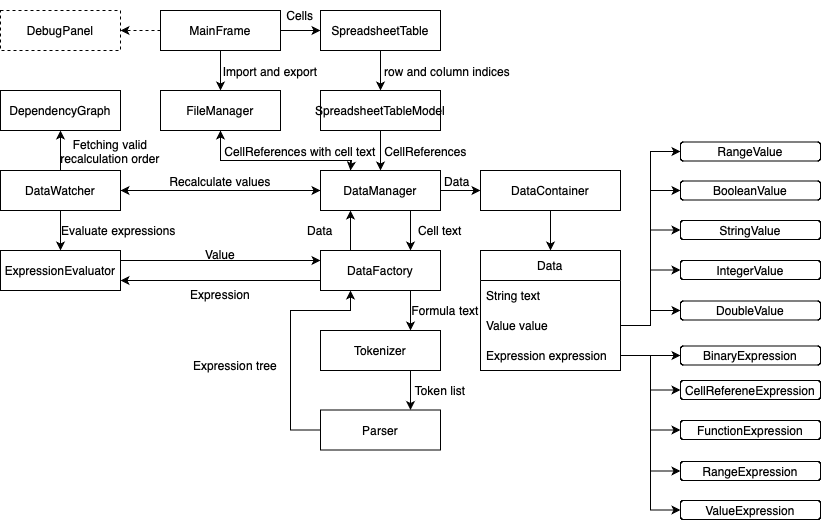

# Application architecture

## Diagram

## 1. Main Components

### 1.1 SpreadsheetTable

The `SpreadsheetTable` represents the core of the user interface where users interact with cells in the grid.
Users can input and modify cell data here.
The `SpreadsheetTable` handles user actions like selection, editing, and key bindings (copy, paste, etc.).

### 1.2 SpreadsheetTableModel

The `SpreadsheetTableModel` is responsible for managing the data in the `SpreadsheetTable`.
It operates with the row and column indices as integers,
transforming it into `CellReference` - record class that encapsulates indices as well as identifier (e.g. `A1`).
All the other responsibilities are delegated to `DataManager`.

### 1.3 MainFrame

The `MainFrame` serves as the container for the entire application.
It holds components like the `SpreadsheetTable`, menus, and `DebugPanel` (if run with `-d` or `--debug` arg).

### 1.4 DebugPanel

The `DebugPanel` is an optional component (dashed lines in the diagram) used for debugging purposes.
It displays additional information about the selected cell, such as the value, type, and any expression associated with it.

---

## 2. Data Management and Flow

### 2.1 DataManager

The `DataManager` acts as the core facilitator of data flow.
It interacts with multiple components to handle data-related operations.
It receives cell text from the `SpreadsheetTableModel` and is responsible for managing the cells and their corresponding `Data` objects.

The `DataManager` connects several components:
- **DataContainer**: Stores all the `Data` objects in a map, where key is `CellReference`.
- **DataFactory**: Creates new `Data` objects from raw text.
- **DataWatcher**: Tracks dependencies between cells and recalculates their values based on changes in other cells.
- **ExpressionEvaluator**: Recalculates cell values by evaluating expressions when needed.

### 2.2 DataContainer

`DataContainer` is responsible for storing the actual data of the spreadsheet.
Each **non-empty** cell in the table has a corresponding `Data` object in the container, and these objects are stored using `CellReference` as keys.
The `DataContainer` serves as a storage unit for the cell data and is accessed by the `DataManager`.

### 2.3 DataFactory

The `DataFactory` is used to create `Data` objects from raw cell text.
When a cell contains a formula (e.g., "=SUM(A1:B3)"), the `DataFactory` passes the text to the `Tokenizer` and `Parser`, which break down the formula into tokens and build an expression tree.
Based on the resulting expression, the `ExpressionEvaluator` calculates the value, and the `DataFactory` creates a corresponding `Data` object that holds the evaluated result.

### 2.4 DataWatcher

The `DataWatcher` ensures that cell dependencies are properly recalculated.
When a cell's value changes, the `DataWatcher` retrieves the correct recalculation order from the `DependencyGraph`, which manages the cell dependencies.
This ensures that cells dependent on others (e.g., cells with formulas referencing other cells) are updated automatically when the referenced cells change.

---

## 3. Formula Handling and Expression Evaluation

### 3.1 Tokenizer and Parser

- **Tokenizer**: The `Tokenizer` is responsible for breaking down the cell text (especially formulas) into individual tokens.
  For example, a formula like `=SUM(A1:B1)` will be tokenized into recognizable parts like `SUM`, `(` `A1`, `:`, `B1`, `)`.

- **Parser**: Once the tokens are generated, the `Parser` builds an **expression tree**.
  This tree represents the structure of the formula in a way that can be evaluated.

### 3.2 Expression Evaluator

The `ExpressionEvaluator` takes the expression tree generated by the `Parser` and computes the actual value.
It supports various operations, such as arithmetic operations, function evaluations (e.g., `SUM`, `MIN`, `MAX`), and references to other cells.
The result is then passed back to the `DataFactory`, which updates the `Data` object for the cell.

---

## 4. Dependency Management

### 4.1 DependencyGraph

The `DependencyGraph` manages the relationships between cells that depend on each other.
For example, if cell `B1` contains a formula that references `A1`, then `A1` is a dependency for `B1`.
The `DependencyGraph` keeps track of these dependencies and provides the correct recalculation order when a cell changes.
This detects circular references and ensures the correct evaluation of dependent cells.

### 4.2 Recalculation Order

When a cell value is modified, the `DataWatcher` consults the `DependencyGraph` to get the correct recalculation order.
This order ensures that cells are recalculated in the right sequence, preventing issues with outdated values being used in formula calculations.

---

## 5. FileManager and Import/Export

The `FileManager` handles the import and export of spreadsheet data.
When exporting, it serializes the `DataContainer` and `CellReferences` into a format that can be saved to a file.
When importing, it deserializes the saved data and populates the `DataManager` with the restored `Data` objects, allowing the spreadsheet to continue working from a saved state.

---

## 6. Value Types

Different types of values are supported by the application, represented as subclasses of the `Value` class:

- **RangeValue**: Represents a range of cells (e.g., `A1:B2`).
- **BooleanValue**: Represents a boolean value (`true` or `false`).
- **StringValue**: Represents textual data.
- **IntegerValue**: Represents integer values.
- **DoubleValue**: Represents decimal (floating-point) values.

These value types are used to store the results of expressions and raw cell data.

---

## 7. Expression Types

Various expression types are supported, allowing for complex formula evaluations:

- **BinaryExpression**: Represents expressions with binary operators (e.g., `A1 + B1`).
- **CellReferenceExpression**: Represents references to other cells (e.g., `A1`).
- **FunctionExpression**: Represents function calls (e.g., `SUM(A1:B1)`).
- **RangeExpression**: Represents a range of cells (e.g., `A1:B1`).
- **ValueExpression**: Represents a literal value in an expression.

These expression types are combined into the expression tree by the `Parser`, enabling powerful formula capabilities.

---
